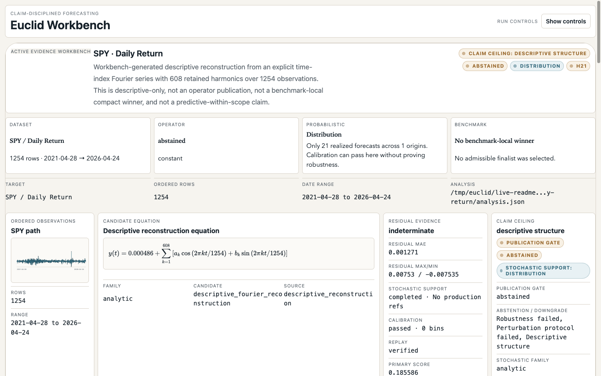
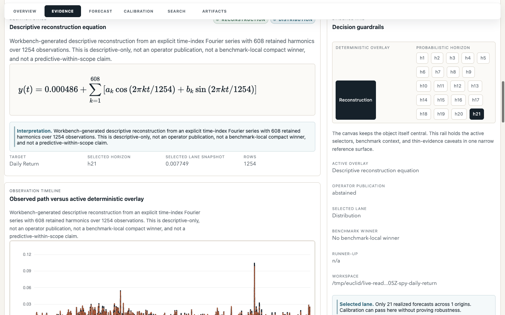
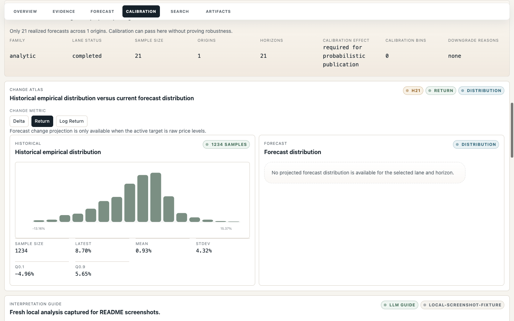
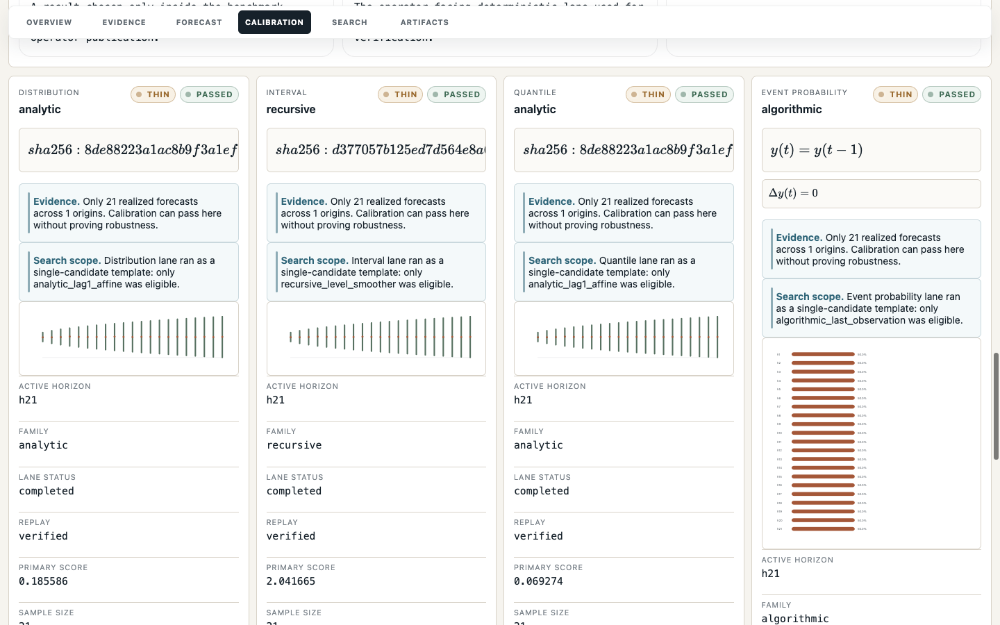
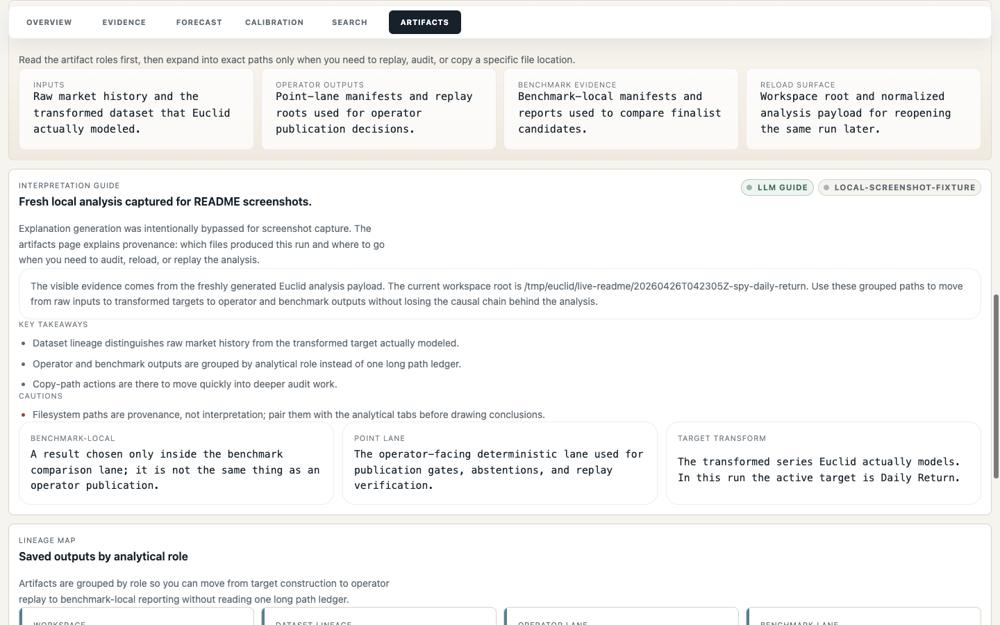
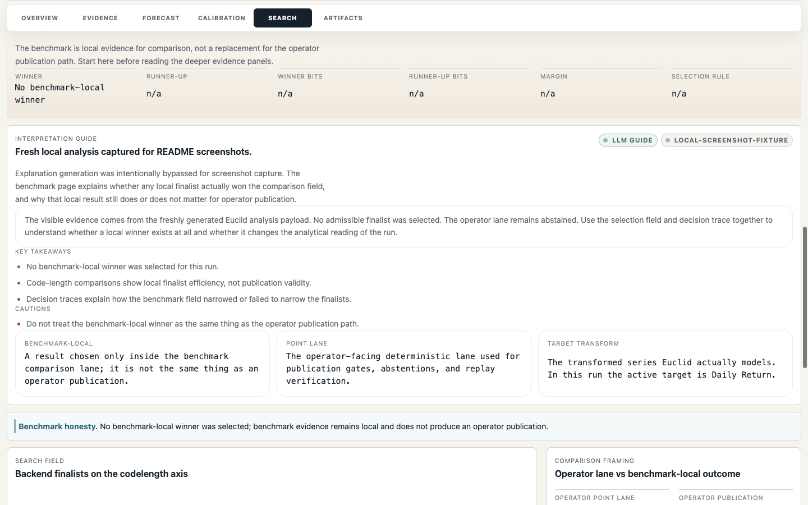
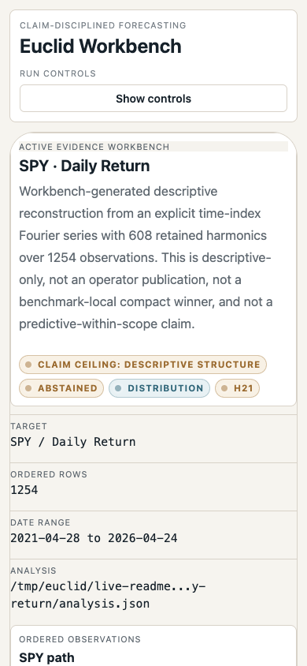

# Euclid Workbench Screenshot Set

## workbench-first-screen.png

Fresh live SPY daily-return first screen with target, descriptive reconstruction equation, residual/stochastic evidence, calibration/replay, and the claim ceiling.

## workbench-evidence.png

Evidence workspace tying ordered observations to the fresh live SPY daily-return reconstruction, residual evidence, stochastic support, and gate language.

## workbench-calibration.png

Calibration and scoring diagnostics from the fresh live SPY daily-return run, with sample size, bins, gate effect, and downgrade limits visible.

## workbench-probabilistic.png

Distribution lane view for the fresh live SPY daily-return run showing uncertainty bands, active horizon, calibration state, and thin-evidence caveats.

## workbench-artifacts.png

Fresh live run artifact roles, replay/reload lineage, and path trail grouped by analytical responsibility.

## workbench-abstention.png

Fresh live SPY daily-return no-winner benchmark state shown as intentional abstention, with local evidence kept below operator publication claims.

## workbench-mobile.png

Mobile view of the fresh live SPY daily-return first screen preserving Euclid identity, claim ceiling, and evidence framing without horizontal overflow.
